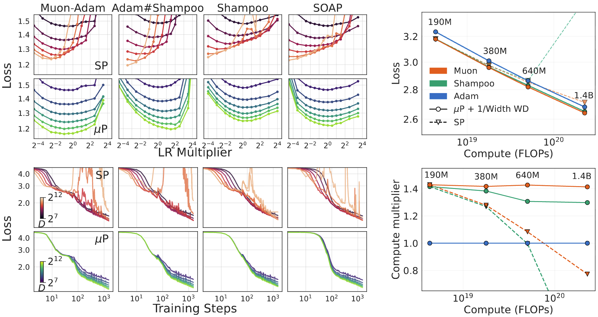

# Hyperparameter Transfer Enables Consistent Gains of Matrix-Preconditioned Optimizers Across Scales
This repository contains the code for the paper [Hyperparameter Transfer Enables Consistent Gains of Matrix-Preconditioned Optimizers Across Scales](https://arxiv.org/abs/2512.05620). It is a fork of [Picodo](https://github.com/martin-marek/picodo) with matrix-preconditioned optimizers and their $\mu\text{P}$ implementations, supporting GPUs, TPUs, single and multi-device training.


<figure>
  
</figure>


# Setup
Install dependencies via
```bash
source setup.py
```

# Data
To prepare the openwebtext dataset used for Figure 2-4:
```bash
python open.py
```
To download the fineweb dataset used for Figrue 5:
```bash
python fineweb.py
```

# Experiments
The experiment configurations are defiend in `sweeps`:
- `lr_open.yaml`: Witdh scaling with $\mu\text{P}$ on openwebtext (Figure 2-3)
- `lr_open_depth.yaml`: Depth scaling on openwebtext (Figure 4) (note `opt.depth_mup` means scaling LR and residual output with depth, but with $\alpha=1$ rather than $\alpha=0.5$ in depth-$\mu\text{P}$)
- `compute_opt_fineweb.yaml`: Compute-optimal width scaling with SP, $\mu\text{P}$, and spectral normalization (Figure 5 left)
- `compute_opt_wd_fineweb.yaml`: Compute-optimal weight decay scaling (Figure 5 right)
- `lr_open_short.yaml`: Short openwebtext smoke-test sweep for optimizer prototyping (includes `gn_subspace_adamw`, with subspace refresh every 50 steps)

To run an experiment, follow
```
# Define the wandb sweep
wandb sweep --project hp_transfer sweeps/lr_open.yaml
# Launch the sweep (replace with your wandb username and the returned sweep id)
CUDA_VISIBLE_DEVICES=0 wandb agent <USERNAME>/hp_transfer/<SWEEP_ID>
```
All results are logged to wandb. See instructions in the `fineweb` branch for running the larger scale (1.4B) experiments.

# Wandb logs

## Section 3
- Witdh scaling with $\mu\text{P}$ on openwebtext (Figure 2-3): [link](https://wandb.ai/shikai/matrix-precond/workspace?nw=fyzwq21qf1)
- Depth scaling on openwebtext (Figure 4): [link](https://wandb.ai/shikai/matrix-precond/workspace?nw=a45w3wk2sk)
- Compute-optimal width scaling with SP, $\mu\text{P}$, and spectral normalization (Figure 5 left): [link](https://wandb.ai/shikai/matrix-precond/workspace?nw=7zu0vlkpbq)
- Compute-optimal weight decay scaling (Figure 5 right): [link](https://wandb.ai/shikai/matrix-precond/workspace?nw=n4m00xx0gj)

Refer to the sweep definition for filtering runs based on hyperparameters (`opt/name`, `opt/lr`, etc.). Be sure to use `/` instead of `.` as separator.

## Base model tuning for Section 4
| Optimizer | Best Loss | Link |
|-----------|-----------|------|
| Adam | 3.236 | [sweep](https://wandb.ai/zc2157/llama_proj/workspace?nw=xvxbubmm6ki) |
| Muon | 3.178 | [sweep](https://wandb.ai/zc2157/llama_proj/workspace?nw=iixe5a26l1) |
| Shampoo | 3.178 | [sweep](https://wandb.ai/zc2157/llama_proj/workspace?nw=z5sgyyo637p) |
| SOAP | 3.175 | [sweep](https://wandb.ai/zc2157/llama_proj/workspace?nw=7unbta5y48t) |
